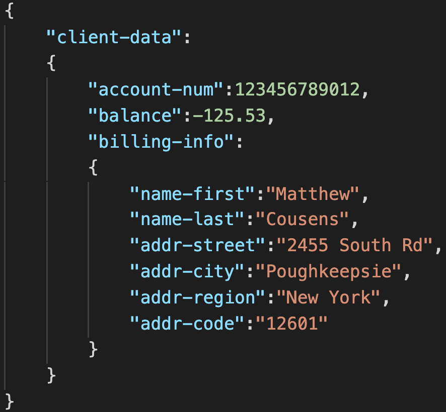
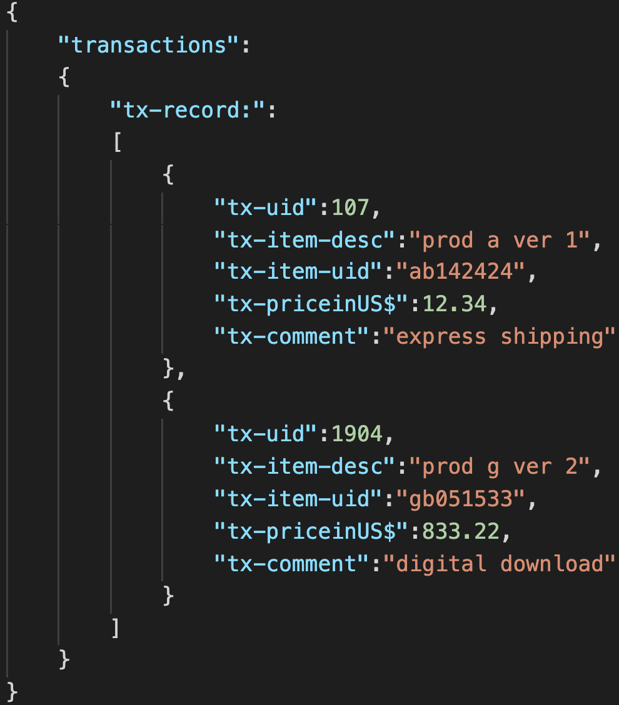
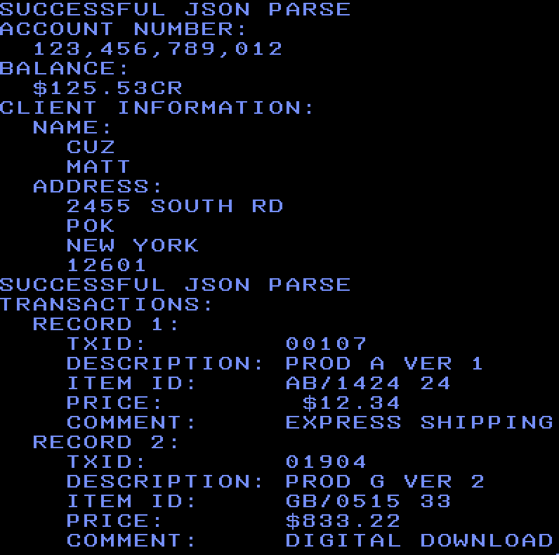

### Using COBOL to Parse JSON

## Introduction
This simple COBOL application demonstrates how to parse JSON using IBM Enterprise COBOL.  It is written to work in a standalone fashion so it can run without any input files.  The JSON string is declared in memory, as are the resuts from the parse, and everything is printed out for clarity.

The first JSON text that we are going to parse contains information about our client and is defined in working storage as `jtxt-1047-client-data`.

It looks like this: 

The second JSON text that we are using contains transaction data stored in a JSON array.  We define it in working storage as `jtxt-1047-transactions`.

It looks like this: 

## Prerequisites
- z/OS system access
- IBM Enterprise COBOL

## Estimated Time
It should take about 30 minutes to complete this tutorial.

## Steps
1. Copy the supplied files to your z/OS system.
There are many ways to transfer the files from this Git repo to your z/OS system.  You could do this directly to z/OS using a Git client running there, or you can use your PC as an intermediate between the Git repo and your z/OS system.

2. Edit the supplied JCL to meet your environment.
You'll need to update each JCL job for your environment.

Things you'll need to customize:
- Data set and volume names
- JOB card definition
- High-level qualifiers in data definitions

3. Compile your program 
Submit `compile.jcl` to invoke the Enterprise COBOL compiler to create an object from your source.  This should complete with MAXCC=0.  Output from the COBOL compiler will go to the JES spool for your review in case you need to debug any programs with the JCL or the COBOL source.

4. Link-edit your object 
Submit `bind.jcl` to invoke the Binder to create an executable from your object file.  This should complete with MAXCC=0.  Output from the Bind will go to the JES spool for your review in case you need to debug any programs with the JCL or the COBOL source.

5. Run the program 
Submit `execute.jcl` to execute the program.  This should complete with MAXCC=0.  Output from the COBOL application will go to the JES spool.

A successful execution should look like: 

## Troubleshooting
You may encounter a problem running this code based on the default character encoding (CCSID)  in your environment.  For example, you may encounter a IGZ0339W at run time on the second JSON parse because of the square brackets in the JSON.  This is the purpose of the `CBL CODEPAGE(DCBS)` command at the top of our program.  Your mileage may vary based on environmental configuration.

## Summary
Parsing JSON in a COBOL application enables connecting back-end applications with today's front-end applications.  The JSON PARSE statement is an easy way to programatically consume a payload in an efficient, easy-to-code manner.

After you have gotten your COBOL application working, feel free to modify the code to work with different types of JSON structures or even read the JSON input from a file.  Visit the Related Links section for places you can refer to for more technical information on COBOL.

## Related Links
[IBM Enterprise COBOL Product Overview](https://www.ibm.com/us-en/marketplace/ibm-cobol)

[IBM Enterprise COBOL Knowledge Center](https://www.ibm.com/support/knowledgecenter/SS6SG3_6.3.0/welcome.html)

[IBM Developer COBOL resource hub](https://developer.ibm.com/technologies/cobol/)

## License
This code pattern is licensed under the Apache License, Version 2. Separate third-party code objects invoked within this code pattern are licensed by their respective providers pursuant to their own separate licenses. Contributions are subject to the [Developer Certificate of Origin, Version 1.1](https://developercertificate.org/) and the [Apache License, Version 2](https://www.apache.org/licenses/LICENSE-2.0.txt).

[Apache License FAQ](https://www.apache.org/foundation/license-faq.html#WhatDoesItMEAN)