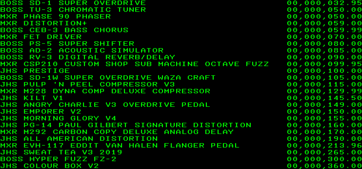

### My First COBOL Application

## Summary
This code pattern introduces you to a simple COBOL application which reads input from three text files, merges their contents, and writes an output containing one sorted list.  We'll spend some time introducing the contents of one of our JCL jobs and the COBOL source as well.  Our hope is to get you familiar with the basics of JCL and COBOL, but we're not trying to make anyone an expert in a few short minutes.

## Description
There are two parts to this application.  First is the COBOL source code itself.  The second part is a set of three JCL jobs which need to be run to compile and build the application into a z/OS executable.  Let's look at each of these pieces.

## Understanding the Supplied JCL
Before we get started working with these files, let's understand what they do.  There are three JCL jobs provided to compile, bind, and execute the COBOL program.
- Compiling transforms source code (COBOL in our case) to objects.
- Binding (also sometimes called link-editing) transforms the objects into executable form.
- Execution is the act of actually running the executables.

JCL might seem scary at first but it's not really all that complicated.  A JCL job is a script that tells z/OS to do something and what files to do it with.  For example, take a look at `compile.jcl`:
- The first statement is called the job card and that is on line 18 of our file.  It gives the name of the job as COBOLCP and defines some environmentals.
- An EXEC statement tells z/OS to execute something and in the case of line 22, we are executing a program (PGM) named IGYCRCTL.  That's what the COBOL compiler is called.
- Data define (DD) statements associate an object name with a file at a particular location.  In the case of line 45 of our compile job, we are connecting SYSIN with the file stored at IBMUSER.MYFIRST(COBOL).  SYSIN is the object that the COBOL compiler uses for its input.

There's a bunch of other DD statements coded in our compile job that are required by the COBOL compiler.  Without these the compiler won't be able to run.

## Understanding the Supplied COBOL
The best way to understand how this program is used is to listed to [Jeff's video](https://developer.ibm.com/technologies/cobol/videos/intro-to-cobol-write-your-first-program).

Now let's take a look at the supplied COBOL application.  A COBOL application is broken into divisions; you can see our code contains four divisions:
1. Identification Divison - where we give our program a name (program-id) and indicate who wrote it.
2. Environment Division - we use this division to detail information about the files we are going to be using in the application.
3. Data Division - this is where you define variables.  In our case we use the file section to describe the fields in the associated files.
4. Procedure Division - this is where we write our COBOL statements.

Now that we have seen the different divisions in a COBOl application, let's take a closer look at some of the statements in our code.  In COBOL, variables are defined with a picture clause, which can be abbreviated as PIC.  Here is a copy of our first variable definition, starting on line 37:<br>
```
       SD  FXLIST-WORK.
       01  FX-REC.
           05 FX-NAME-W      PIC X(50).
           05 FX-PRICE-W     PIC $$,$$$,$$9.99.
           05 FILLER PIC X(17).
```
First we have SD which declares a Sort File Description Entry named `FXLIST-WORK`.

`FX-REC` defines the record, which is made up of the three parts that appear on the following three lines with level 05 descriptors.

Part of the power of COBOL's ability to work with data lies in its picture statements.  For an exhaustive list of ways you can declare data, visit the Enterprise COBOL Language Reference's [PICTURE clause section](https://www.ibm.com/support/knowledgecenter/SS6SG3_6.3.0/lr/ref/rlddepic.html).  Our first record field is name `FX-NAME-W` and it is declared to hold 50 alphanumeric characters.  That is followed by `FX-PRICE-W` which is a currency field, so its declaration is set up to have comma thousands separators and have two positions after the decimal place.  Finally, the record is filled with 17 blank characters called `FILLER`.  The other variables defined in the Data Division are set up a similar way.

The real action takes place in the Procedure Division.  We print out a message on line 80 to show that our execution has started.  Since our input is coming in three separate files, we first need to combine the lists into a single list before we sort it.  We use a MERGE statement to do just that on line 81.  This statement takes the contents of the files defined by `FXLIST-B`, `FXLIST-M`, and `FXLIST-J` and stores them as a single list named `FXLIST-MERGE`.  Finally, we sort that merged list with a SORT statement in ascending order by the price in the `FX-PRICE-W` field, placing the sorted listed in `FXLIST-SORTED`.  The COBOL application writes that file before displaying a final message and ending execution.  You can see the power of COBOL in thisd division: a lot of work is completed in just two statements.

## Flow
Insert diagram here

## Instructions
1. Copy the supplied files to your z/OS system<br>
There are many ways to transfer the files from this Git repo to your z/OS system. You could do this directly to z/OS using a Git client running there, or you can use your PC as an intermediate between the Git repo and your z/OS system.

2. Edit the supplied JCL to meet your environment<br>
The jobs supplied in this Git repo work on my system, but they might not work on your system unless you modify them.
<br> <br>
Things you'll need to customize:
- Data set and volume names
- JOB card definition
- High-level qualifiers in data definitions

3. Compile your program<br>
Submit `compile.jcl` to invoke the Enterprise COBOL compiler to create an object from your source.  This should complete with MAXCC=0.  Output from the COBOL compiler will go to the JES spool for your review in case you need to debug any programs with the JCL or the COBOL source.

4. Link-edit your object<br>
Submit `bind.jcl` to invoke the Binder to create an executable from your object file.  This should complete with MAXCC=0.  Output from the Bind will go to the JES spool for your review in case you need to debug any programs with the JCL or the COBOL source.

5. Run the program<br>
Submit `execute.jcl` to execute the program.  This should complete with MAXCC=0.  Output from the COBOL application will go to the JES spool.

You should see the following in your output file from a successful run:


## Related Links
- [My First COBOL Application video](https://developer.ibm.com/technologies/cobol/videos/intro-to-cobol-write-your-first-program)
- [IBM Developer COBOL Hub](https://developer.ibm.com/technologies/cobol/)
- [IBM Enterprise COBOL Product Overview](https://www.ibm.com/us-en/marketplace/ibm-cobol)
- [IBM Enterprise COBOL Knowledge Center](https://www.ibm.com/support/knowledgecenter/SS6SG3_6.3.0/welcome.html)

## Next Steps
This application demonstrates how COBOL process input and output, as well as some of its data manipulation powers.  If you'd like to test your COBOL powers, there are a number of things that you can do.  Would you like to improve the output by adding a report header, dollar sign, remove the leading zeros?  Go right ahead and give it a whirl.  You can dig into the Enterprise COBOL Knowledge Center if you need product documentation to get you started.  Good luck! 

## License
This code pattern is licensed under the Apache License, Version 2. Separate third-party code objects invoked within this code pattern are licensed by their respective providers pursuant to their own separate licenses. Contributions are subject to the [Developer Certificate of Origin, Version 1.1](https://developercertificate.org/) and the [Apache License, Version 2](https://www.apache.org/licenses/LICENSE-2.0.txt).

[Apache License FAQ](https://www.apache.org/foundation/license-faq.html#WhatDoesItMEAN)